# Inference system optimizer

The inference system optimizer assigns GPU types to inference model servers and decides on the number of replicas for each model for a given request traffic load and classes of service, as well as the batch size. ([slides](docs/slides/inferno-dynamic.pdf))

## Building

```bash
docker build -t  inferno . --load
```

## Running

First, install [prerequisites](services/README.md#prerequisites).

There are several ways to run the optimizer.

1. **Direct function calls**: An example is provided in [main.go](demos/main/main.go).

    ```bash
    cd demos/main
    go run main.go
    ```

1. **REST API server**: The optimizer may run as a REST API server ([instructions](rest-server/README.md)).

1. **Kubernetes controller**: Running in a Kubernetes cluster and using custom resources and a Kubernetes runtime controller, the optimizer may be excercised in reconciliation to updates to the Optimizer custom resource ([reference](https://github.com/llm-inferno/controller)).

1. **Optimization control loop**: The control loop comprises (1) a Collector to get data about the inference servers through Prometheus and server deployments, (2) an Optimizer to make decisions, (3) an Actuator to realize such decisions by updating server deployments, and (4) a periodic Controller that has access to static and dynamic data. The control loop may run either externally ([instructions](services/README.md)) or in a Kubernetes cluster. Following are the steps to run the optimization control loop within a cluster.

### In-cluster optimization control loop

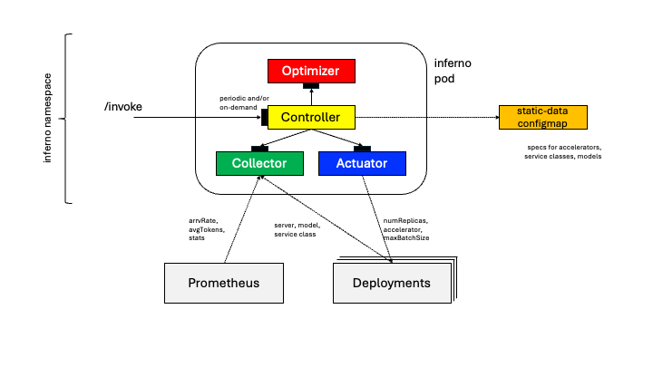

- Create or have access to a cluster.

- Clone this repository and set environment variable `INFERNO_REPO` to the path to it.

- Create namespace *inferno*, where all optimizer components will reside.

    ```bash
    cd $INFERNO_REPO/manifests/yamls
    kubectl apply -f ns.yaml
    ```

- Create a configmap populated with inferno static data, e.g. samples taken from the *large* directory.

    ```bash
    INFERNO_DATA_PATH=$INFERNO_REPO/samples/large
    kubectl create configmap inferno-static-data -n inferno \
    --from-file=/$INFERNO_DATA_PATH/accelerator-data.json \
    --from-file=/$INFERNO_DATA_PATH/model-data.json \
    --from-file=/$INFERNO_DATA_PATH/serviceclass-data.json \
    --from-file=/$INFERNO_DATA_PATH/optimizer-data.json
    ```

- Create a configmap populated with inferno dynamic data (count of accelerator types).

    ```bash
    kubectl create configmap inferno-dynamic-data -n inferno --from-file=/$INFERNO_DATA_PATH/capacity-data.json 
    ```

- Deploy inferno in the cluster.

    ```bash
    kubectl apply -f deploy-loop.yaml
    ```

- Get the inferno pod name.

    ```bash
    POD=$(kubectl get pod -l app=inferno -n inferno -o jsonpath="{.items[0].metadata.name}")
    ```

- Inspect logs.

    ```bash
    kubectl logs -f $POD -n inferno -c controller
    kubectl logs -f $POD -n inferno -c collector
    kubectl logs -f $POD -n inferno -c optimizer
    kubectl logs -f $POD -n inferno -c actuator
    ```

- Create deployments representing inference servers in namespace *infer*.

    ```bash
    cd $INFERNO_REPO/services/yamls
    kubectl apply -f ns.yaml
    kubectl apply -f dep1.yaml,dep2.yaml,dep3.yaml
    ```

    Note that the deployment should have the following labels set (a missing service class name defaults to *Free*)

    ```bash
    labels:
        inferno.server.managed: "true"
        inferno.server.name: vllm-001
        inferno.server.model: llama_13b
        inferno.server.class: Premium
        inferno.server.allocation.accelerator: MI250
    ```

    and some optional labels (if metrics are not available from  Pometheus).

    ```bash
    labels:
        inferno.server.allocation.maxbatchsize: "8"
        inferno.server.load.rpm: "30"
        inferno.server.load.numtokens: "2048"
    ```

- Observe changes in the number of pods (replicas) for all inference servers (deployments).

    ```bash
    watch kubectl get pods -n infer
    ```

- (Optional) Start a load emulator to inference servers.

    ```bash
    cd $INFERNO_REPO/manifests/yamls
    kubectl apply -f load-emulator.yaml
    kubectl logs -f load-emulator -n inferno
    ```

- Invoke an inferno control loop.

    ```bash
    kubectl port-forward service/inferno -n inferno 8080:80
    curl http://localhost:8080/invoke
    ```

- Cleanup

    ```bash
    cd $INFERNO_REPO/manifests/yamls
    kubectl delete -f load-emulator.yaml
    kubectl delete -f deploy-loop.yaml 
    kubectl delete configmap inferno-static-data inferno-dynamic-data -n inferno
    kubectl delete -f ns.yaml

    cd $INFERNO_REPO/services/yamls
    kubectl delete -f dep1.yaml,dep2.yaml,dep3.yaml
    kubectl delete -f ns.yaml
    ```

## Description

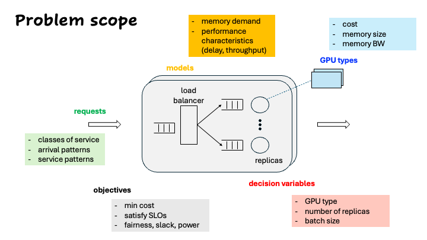

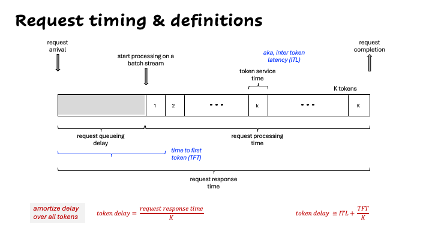


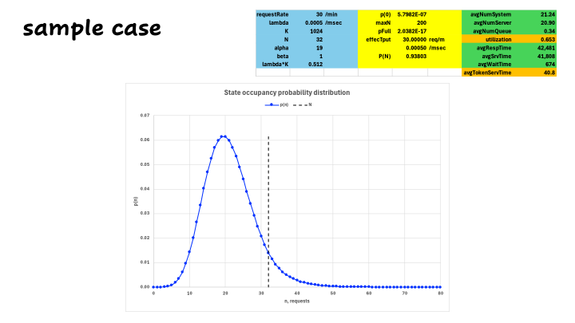

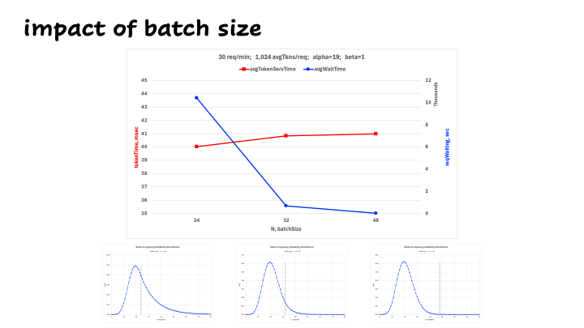

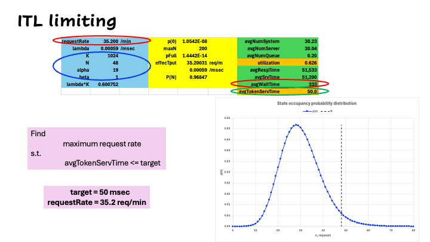

Decision variables

For each pair of (class of service, model):

- gpuProfile: the GPU type allocated
- numReplicas: the number of replicas
- batchSize: the batch size, given continuous batching

## Specifications: Accelerators and models

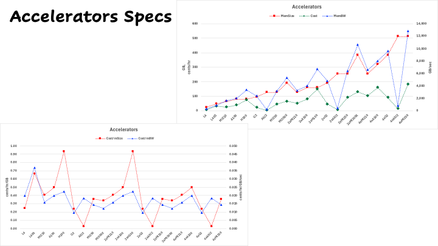

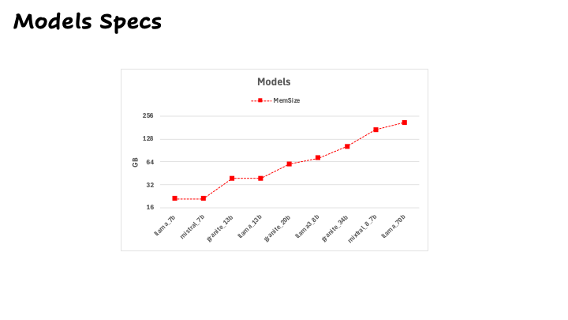

## Example 1: Unlimited accelerators

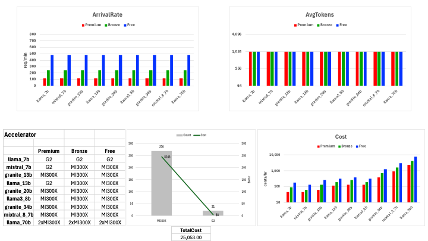

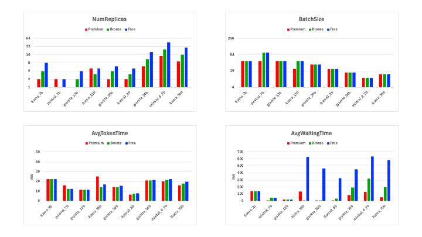

## Example 2: Load change - Unlimited accelerators

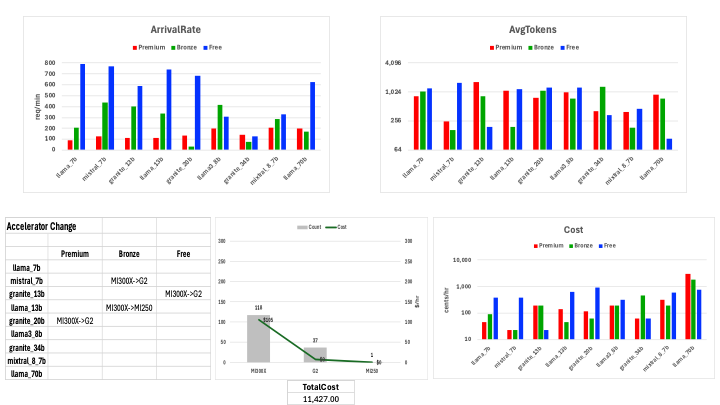

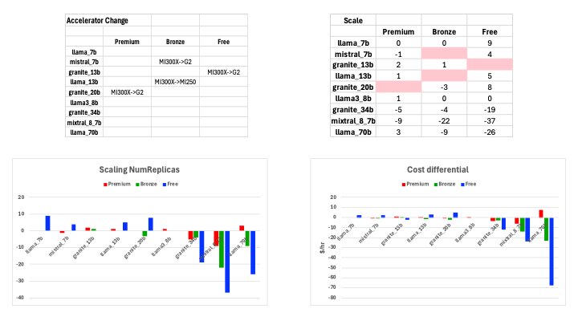

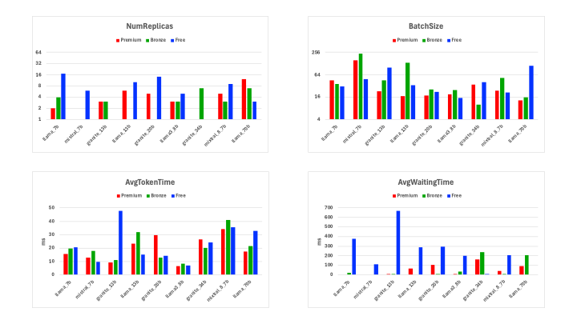

## Example 3: Limited accelerators


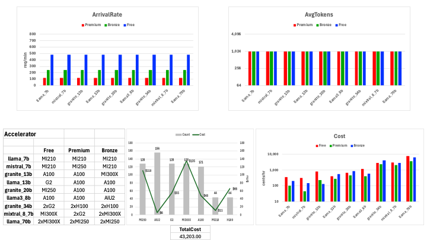


## Example 4: Load change - Limited accelerators

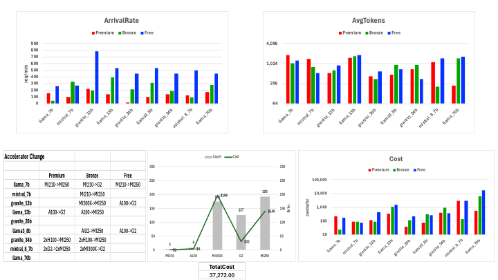

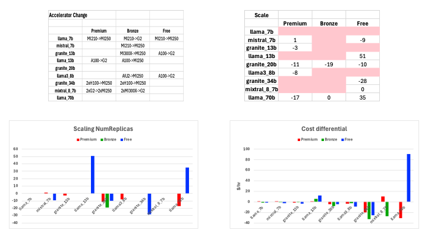

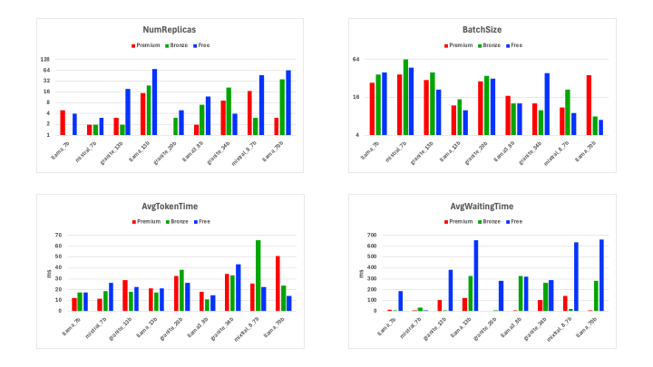
