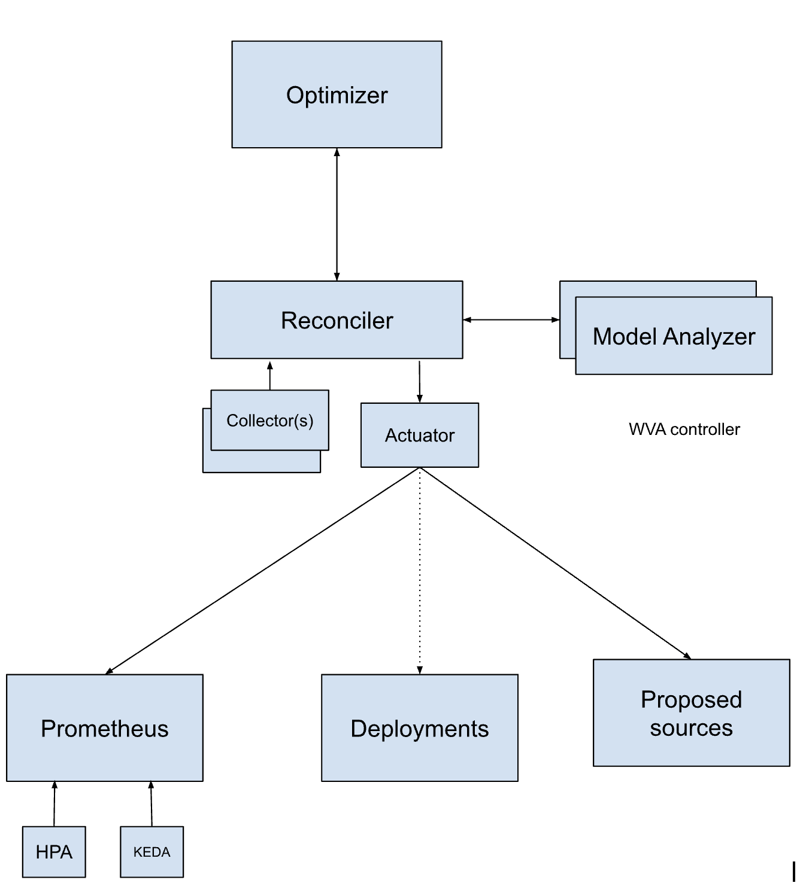

# Workload-Variant-Autoscaler (WVA)

[](https://goreportcard.com/report/github.com/llm-d-incubation/workload-variant-autoscaler)
[](LICENSE)

**GPU-aware autoscaler for LLM inference workloads with optimal resource allocation**

The Workload-Variant-Autoscaler (WVA) is a Kubernetes controller that performs intelligent autoscaling for inference model servers. It assigns GPU types to models, determines optimal replica counts for given request traffic loads and service classes, and configures batch sizes—all while optimizing for cost and performance.



## Key Features

- **Intelligent Autoscaling**: Optimizes replica count and GPU allocation based on workload, performance models, and SLO requirements
- **Multi-GPU Support**: Can select optimal GPU types (NVIDIA, AMD, Intel) when multiple accelerator profiles are configured
- **Cost Optimization**: Minimizes infrastructure costs while meeting SLO requirements  
- **Performance Modeling**: Uses queueing theory (M/M/1/k, M/G/1 models) for accurate latency and throughput prediction
- **Multi-Model Support**: Manages multiple models with different service classes and priorities
- **Production Ready**: Integrates with HPA, KEDA, Prometheus, and llm-d infrastructure

## Quick Start

### Prerequisites

- Kubernetes v1.32.0+
- Helm 3.x
- kubectl

### Install with Helm (Recommended)

```bash
# Add the WVA Helm repository (when published)
helm upgrade -i workload-variant-autoscaler ./charts/workload-variant-autoscaler \
  --namespace workload-variant-autoscaler-system \
  --set-file prometheus.caCert=/tmp/prometheus-ca.crt \
  --set variantAutoscaling.accelerator=L40S \
  --set variantAutoscaling.modelID=unsloth/Meta-Llama-3.1-8B \
  --set vllmService.enabled=true \
  --set vllmService.nodePort=30000
  --create-namespace
```

### Try it Locally with Kind

```bash
# Deploy WVA with llm-d infrastructure on a local Kind cluster
make deploy-llm-d-inferno-emulated-on-kind

# This creates a Kind cluster with emulated GPUs and deploys:
# - WVA controller
# - llm-d infrastructure (simulation mode)
# - Prometheus and monitoring stack
# - vLLM emulator for testing
```

See the [Installation Guide](docs/user-guide/installation.md) for detailed instructions.

## Documentation

### User Guide
- [Installation Guide](docs/user-guide/installation.md)
- [Configuration](docs/user-guide/configuration.md)
- [CRD Reference](docs/user-guide/crd-reference.md)

### Tutorials
- [Quick Start Demo](docs/tutorials/demo.md)
- [Parameter Estimation](docs/tutorials/parameter-estimation.md)
- [vLLM Server Setup](docs/tutorials/vllm-samples.md)

### Integrations
- [HPA Integration](docs/integrations/hpa-integration.md)
- [KEDA Integration](docs/integrations/keda-integration.md)
- [Prometheus Metrics](docs/integrations/prometheus.md)

### Design & Architecture
- [Architecture Overview](docs/design/modeling-optimization.md)
- [Design Diagrams](docs/design/diagrams/)

### Developer Guide
- [Development Setup](docs/developer-guide/development.md)
- [Testing](docs/developer-guide/testing.md)
- [Contributing](CONTRIBUTING.md)

### Deployment Options
- [Kubernetes Deployment](deploy/kubernetes/README.md)
- [OpenShift Deployment](deploy/openshift/README.md)
- [Local Development (Kind Emulator)](deploy/kind-emulator/README.md)

## Architecture

WVA consists of several key components:

- **Reconciler**: Kubernetes controller that manages VariantAutoscaling resources
- **Collector**: Gathers cluster state and vLLM server metrics
- **Model Analyzer**: Performs per-model analysis using queueing theory
- **Optimizer**: Makes global scaling decisions across models
- **Actuator**: Emits metrics to Prometheus and updates deployment replicas

For detailed architecture information, see the [design documentation](docs/design/modeling-optimization.md).

## How It Works

1. Platform admin creates a `VariantAutoscaling` CR for each model
2. WVA continuously monitors request rates and server performance
3. Model Analyzer estimates latency and throughput using queueing models
4. Optimizer solves for minimal cost allocation meeting all SLOs
5. Actuator emits metrics for HPA/KEDA or directly scales replicas

## Example

```yaml
apiVersion: llmd.ai/v1alpha1
kind: VariantAutoscaling
metadata:
  name: llama-8b-autoscaler
  namespace: llm-inference
spec:
  modelName: "meta/llama-3.1-8b"
  serviceClass: "Premium"
  acceleratorType: "A100"
  minReplicas: 1
  maxBatchSize: 256
```

More examples in [config/samples/](config/samples/).

## Contributing

We welcome contributions! Please see [CONTRIBUTING.md](CONTRIBUTING.md) for guidelines.

Join the llm-d autoscaling community meetings to get involved.

## License

Apache 2.0 - see [LICENSE](LICENSE) for details.

## Related Projects

- [llm-d infrastructure](https://github.com/llm-d-incubation/llm-d-infra)
- Community proposal: [Google Doc](https://docs.google.com/document/d/1n6SAhloQaoSyF2k3EveIOerT-f97HuWXTLFm07xcvqk/edit)

## Status

This project is in **alpha** stage. The API (v1alpha1) may change in future releases.

---

For detailed documentation, visit the [docs](docs/) directory or read the [full documentation online](#).
