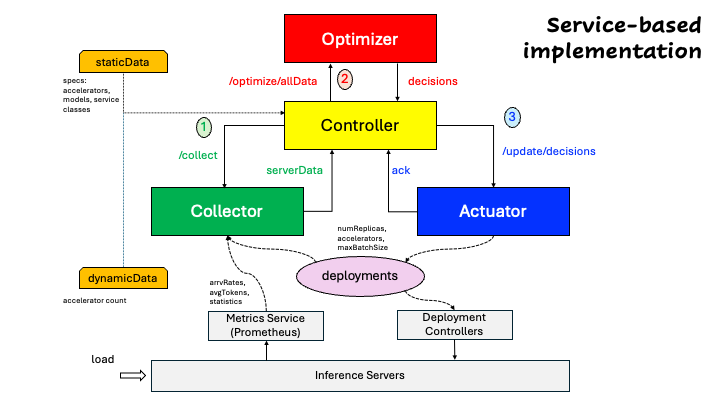
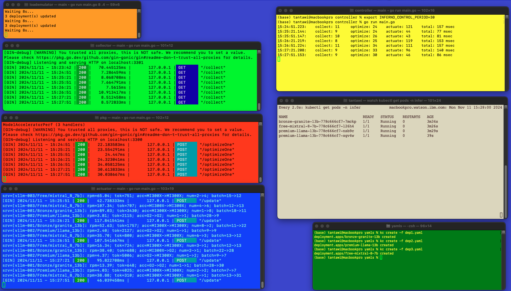

# Control loop



## Demo

### Prerequisites

- lp_solve Mixed Integer Linear Programming (MILP) solver

  Installation instructions and code in [lpsolve repository](https://github.com/llm-inferno/lpsolve)

- IBM CPLEX (optional)

  Information and instructions [IBM CPLEX as a solver](https://github.com/llm-inferno/lpsolve/tree/main/cplex)

### Steps to run a demo of the control loop

- Create a Kubernetes cluster and make sure `$HOME/.kube/config` points to it.
- Run script to create terminals for the various components. You may need to install [term](https://github.com/liyanage/macosx-shell-scripts/blob/master/term) and add terminal coloring support. (Hint: [Change OSX Terminal Settings from Command Line](https://ict4g.net/adolfo/notes/admin/change-osx-terminal-settings-from-command-line.html))

    ```bash
    cd $INFERNO_REPO/services/scripts
    ./launch-terms.sh
    ```

    where `$INFERNO_REPO` is the path to this repository.

    

    In this demo there are five components: Collector, Optimizer, Actuator, Controller, and Load Emulator.
    Terminals for the Collector, Optimizer, Actuator, and Controller are (light) green, red, blue, and yellow, repectively.
    The Load Emulator is orange.
    The green terminal is for interaction with the cluster through kubectl commands.
    And, the beige terminal to observe the currently running pods.

- Set the data path to the data (static+dynamic) for the Controller (yellow).

    ```bash
    export INFERNO_DATA_PATH=$INFERNO_REPO/samples/large/
    ```

- Set the environment in all of the (five) component terminals.

    ```bash
    . $INFERNO_REPO/services/scripts/setparms.sh
    ```

- Deploy sample deployments (green terminal) in namespace `infer`, representing three inference servers.

    ```bash
    kubectl apply -f ns.yaml
    kubectl apply -f dep1.yaml,dep2.yaml,dep3.yaml
    ```

- Observe (beige) changes in the number of pods (replicas) for all inference servers (deployments).

    ```bash
    watch kubectl get pods -n infer
    ```

- Run the components.

  - Collector (light green), Optimizer (red), and Actuator (blue)
  
    ```bash
    go run main.go
    ```

  - Controller (yellow)
  
    ```bash
    go run main.go <controlPeriodInSec> <isDynamicMode>
    ```

    The control period dictates the frequency with which the Controler goes through a control loop (default 60).
    In addition, the Controler runs as a REST server with an endpoint `/invoke` for on-demand activation of the control loop.
    Hence, **periodic** as well as **aperiodic** modes are supported simultaneously.
    Setting `controlPeriodInSec` to zero makes the Controller run in the **aperiodic** mode only.

    ```bash
    curl http://$CONTROLLER_HOST:$CONTROLLER_PORT/invoke
    ```

    (Default is localhost:3300)

    Further, there is an option for running the Controller in dynamic mode.
    This means that, at the beginning of every control cycle, the (static) data files are read (default false).
    The arguments for the Controller may also be set through the environment variables `INFERNO_CONTROL_PERIOD` and `INFERNO_CONTROL_DYNAMIC`, respectively.
    The command line arguments override the values of the environment variables.

  - Load Emulator (orange)
  
    ```bash
    go run main.go <intervalInSec> <alpha (0,1)>
    ```

    The Load Emulator periodically, given by the argument `intervalInSec`, pertubs the values of request rate and average number of tokens per request for all inference servers (deployments) in the cluster. The disturbance amount is normally distributed with zero mean and `sigma` standard deviation, where `sigma = alpha * originalUndisturbedValue`.
    (Default arguments are 60 and 0.5, respectively.)

Ctrl-c to stop all components.
